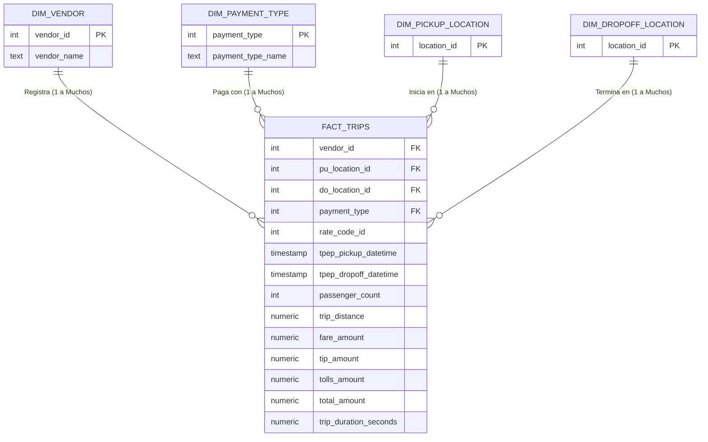

# NY Taxi Data Pipeline - Arquitectura ELT (2015-2025)

## 1. Objetivo del Proyecto
El objetivo de este proyecto es construir una solución *end-to-end* para ingerir, almacenar, transformar y modelar datos históricos de viajes de NY Taxi correspondientes al período 2023-2026. Se ha diseñado una arquitectura ELT reproducible y orquestada, desplegada íntegramente con Docker Compose. La solución utiliza Mage AI como orquestador de tuberías de datos, PostgreSQL como *Data Warehouse* y pgAdmin como herramienta de inspección y validación.

## 🏗️ 2. Arquitectura
### Herramientas y Justificación

La arquitectura se diseñó bajo un enfoque **ELT (Extract, Load, Transform)** estrictamente local y orquestado.

* **Docker Compose:** Es la columna vertebral de la infraestructura.
  * *¿Por qué?* Garantiza la **reproducibilidad**. Permite levantar toda la red de servicios (bases de datos, orquestadores y UI) con un solo comando, asegurando que los puertos, redes internas y volúmenes de persistencia funcionen igual en cualquier máquina.

 4.21.46 p. m..png)

* **Mage AI:** El motor de orquestación.
  * *¿Por qué?* A diferencia de *scripts* sueltos, Mage permite encadenar dependencias lógicas, programar ejecuciones (triggers), y manejar particiones de código (bloques). Además, gestiona de forma nativa variables de entorno y *secrets* (vía `io_config.yaml`), cumpliendo la regla estricta de no *hardcodear* credenciales.
* **PostgreSQL:** El *Data Warehouse* central.
  * *¿Por qué?* Es un motor relacional robusto capaz de almacenar millones de registros (capa `raw`) y ejecutar procesamiento analítico pesado in-database (capa `clean`) mediante consultas SQL nativas.
* **pgAdmin:** La capa de observabilidad.
  * *¿Por qué?* Proporciona una interfaz gráfica ligera para auditar las tablas, validar el modelo de datos y ejecutar consultas de comprobación sin necesidad de conectarse por la terminal.


### 🔄 2. Flujo de Datos: Inyección, Obtención y Tratamiento

El flujo de información obedece a una estricta separación de responsabilidades a través de dos tuberías.

### Fase A: Extracción y Carga (El Pipeline Raw)
El objetivo aquí es obtener los datos fuente y aterrizarlos en la base de datos de la forma más fiel y segura posible.
* **Obtención Incremental:** El `Data Loader` en Python no descarga a ciegas. Primero, se conecta a PostgreSQL para buscar la fecha máxima cargada (`MAX(tpep_pickup_datetime)`). Basado en esto, genera dinámicamente las URLs solo de los meses faltantes de los archivos `.parquet` del NY TLC.
* **Inyección Optimizada (Chunking):** Dado que cada archivo pesa cientos de megabytes y contiene millones de filas, los datos se descargan mediante *streaming* (`requests.get(stream=True)`) y se insertan a PostgreSQL en lotes de 200,000 registros. Esto previene que la memoria RAM del contenedor Docker colapse.
* **Manejo de Schema Drift:** Si el archivo Parquet trae una columna que no existía en meses anteriores, el código lo detecta e inyecta dinámicamente un `ALTER TABLE` en PostgreSQL para agregar la nueva columna de tipo `TEXT`, evitando que el pipeline se rompa.

### Fase B: Tratamiento y Modelado (El Pipeline Clean)
Aquí aplicamos la "T" del ELT directamente dentro de PostgreSQL para estandarizar los datos y prepararlos para el consumo analítico.
* **Transformación *In-Database*:** Mage actúa únicamente como un "gatillo". El `Data Exporter` envía un macro-script SQL que PostgreSQL procesa utilizando su propio motor de cómputo.
* **Limpieza (Data Quality):** Se aplican filtros duros (`WHERE trip_distance > 0 AND passenger_count > 0`) para eliminar registros imposibles o ruidosos.
* **Tipado Riguroso:** Se aplica un doble *casting* (`::numeric::int` y `::timestamp`) para asegurar que IDs categóricos sean enteros puros y las fechas sean marcas de tiempo válidas.

---

### 🗄️ 3. Anatomía de las Tablas (El Modelo Dimensional)

La capa analítica (`clean`) está estructurada bajo un **Modelo de Estrella (Star Schema)**, compuesto por una tabla central de hechos rodeada de dimensiones descriptivas.

### 🔹 Tabla de Hechos (Fact Table)
**`clean.fact_trips`**: Es el corazón del modelo. Su granularidad es exacta: **1 fila = 1 viaje de taxi**.
* *Claves Foráneas (FK):* `vendor_id`, `pu_location_id`, `do_location_id`, `payment_type`, `rate_code_id`.
* *Timestamps:* `tpep_pickup_datetime`, `tpep_dropoff_datetime`.
* *Métricas Base:* `passenger_count`, `trip_distance`.
* *Métricas Financieras:* `fare_amount` (tarifa base), `extra`, `mta_tax`, `tip_amount` (propina), `tolls_amount` (peajes), `improvement_surcharge`, `total_amount` (monto total).
* *Métricas Derivadas:* `trip_duration_seconds` (calculada restando el tiempo de bajada del de subida).

### 🔸 Dimensiones (Dimension Tables)
Proporcionan el contexto de texto a los IDs numéricos de la tabla de hechos.
* **`clean.dim_vendor`**:
  * `vendor_id` (INT, Clave Primaria)
  * `vendor_name` (TEXT): Almacena los nombres comerciales ('Creative Mobile', 'VeriFone').
* **`clean.dim_payment_type`**:
  * `payment_type` (INT, Clave Primaria)
  * `payment_type_name` (TEXT): Decodifica el método ('Credit Card', 'Cash', 'No Charge', 'Dispute').
* **`clean.dim_pickup_location`**:
  * `location_id` (INT, Clave Primaria): Lista única de las zonas origen autorizadas en NY.
* **`clean.dim_dropoff_location`**:
  * `location_id` (INT, Clave Primaria): Lista única de las zonas destino.

### 🕸️ 4. Diagrama de Grafo del Modelo Estrella

A continuación se presenta la representación visual de la topología de la base de datos `clean` y cómo se comunican las tablas. Las entidades descriptivas (dimensiones) filtran y contextualizan el evento transaccional central (hechos).




### 🚀 3. Pasos para levantar el entorno
Toda la infraestructura está dockerizada para garantizar la reproducibilidad.

1. **Clonar el repositorio:**
   ```bash
   git clone <tu-repositorio>
   cd pset2_ny_taxi
    ```