# NY Taxi Data Pipeline - Arquitectura ELT (2015-2025)

## 1. Objetivo del Proyecto
El objetivo de este proyecto es construir una solución *end-to-end* para ingerir, almacenar, transformar y modelar datos históricos de viajes de NY Taxi correspondientes al período 2023-2026. Se ha diseñado una arquitectura ELT reproducible y orquestada, desplegada íntegramente con Docker Compose. La solución utiliza Mage AI como orquestador de tuberías de datos, PostgreSQL como *Data Warehouse* y pgAdmin como herramienta de inspección y validación.

## 🏗️ 2. Arquitectura
### Herramientas y Justificación

La arquitectura se diseñó bajo un enfoque **ELT (Extract, Load, Transform)** estrictamente local y orquestado.

* **Docker Compose:** Es la columna vertebral de la infraestructura.
  * *¿Por qué?* Garantiza la **reproducibilidad**. Permite levantar toda la red de servicios (bases de datos, orquestadores y UI) con un solo comando, asegurando que los puertos, redes internas y volúmenes de persistencia funcionen igual en cualquier máquina.

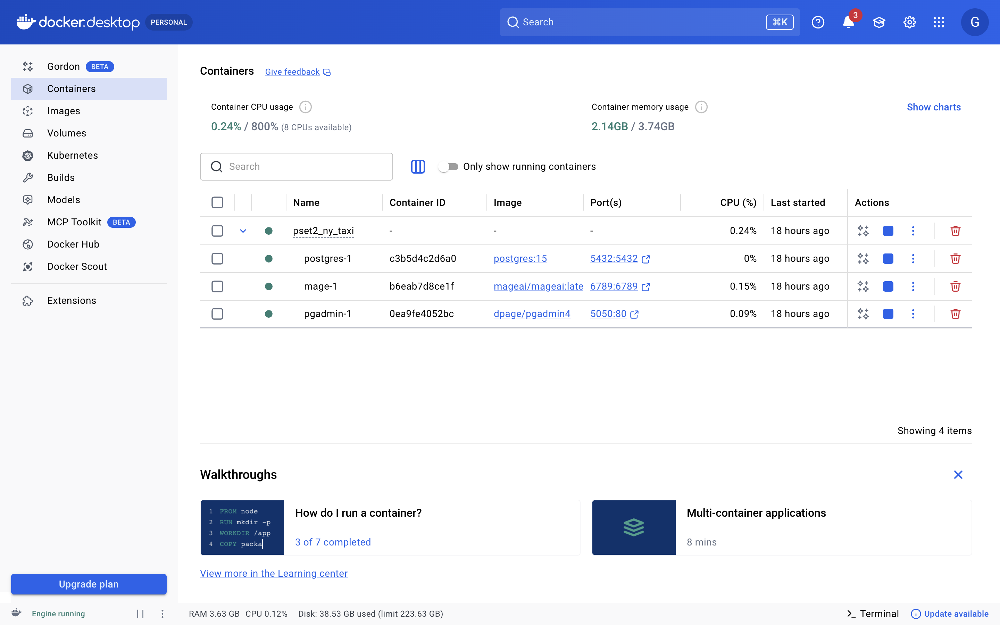

* **Mage AI:** El motor de orquestación.
  * *¿Por qué?* A diferencia de *scripts* sueltos, Mage permite encadenar dependencias lógicas, programar ejecuciones (triggers), y manejar particiones de código (bloques). Además, gestiona de forma nativa variables de entorno y *secrets* (vía `io_config.yaml`), cumpliendo la regla estricta de no *hardcodear* credenciales.

* **PostgreSQL:** El *Data Warehouse* central.
  * *¿Por qué?* Es un motor relacional robusto capaz de almacenar millones de registros (capa `raw`) y ejecutar procesamiento analítico pesado in-database (capa `clean`) mediante consultas SQL nativas.
* **pgAdmin:** La capa de observabilidad.
  * *¿Por qué?* Proporciona una interfaz gráfica ligera para auditar las tablas, validar el modelo de datos y ejecutar consultas de comprobación sin necesidad de conectarse por la terminal.


### 🔄 2. Flujo de Datos: Inyección, Obtención y Tratamiento

El flujo de información obedece a una estricta separación de responsabilidades a través de dos tuberías.

### Fase A: Extracción y Carga (El Pipeline Raw)
El objetivo aquí es obtener los datos fuente y aterrizarlos en la base de datos de la forma más fiel y segura posible.
* **Obtención Incremental:** El `Data Loader` en Python no descarga a ciegas. Primero, se conecta a PostgreSQL para buscar la fecha máxima cargada (`MAX(tpep_pickup_datetime)`). Basado en esto, genera dinámicamente las URLs solo de los meses faltantes de los archivos `.parquet` del NY TLC.


* **Inyección Optimizada (Chunking):** Dado que cada archivo pesa cientos de megabytes y contiene millones de filas, los datos se descargan mediante *streaming* (`requests.get(stream=True)`) y se insertan a PostgreSQL en lotes de 200,000 registros. Esto previene que la memoria RAM del contenedor Docker colapse.
* **Manejo de Schema Drift:** Si el archivo Parquet trae una columna que no existía en meses anteriores, el código lo detecta e inyecta dinámicamente un `ALTER TABLE` en PostgreSQL para agregar la nueva columna de tipo `TEXT`, evitando que el pipeline se rompa.

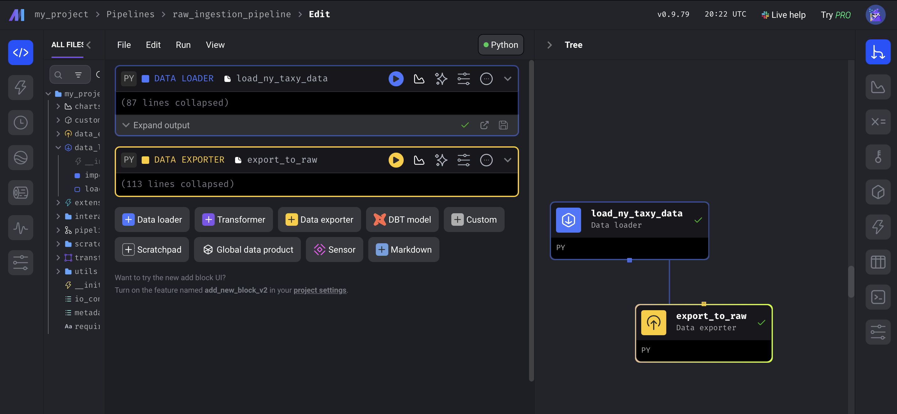

### Fase B: Tratamiento y Modelado (El Pipeline Clean)
Aquí aplicamos la "T" del ELT directamente dentro de PostgreSQL para estandarizar los datos y prepararlos para el consumo analítico.
* **Transformación *In-Database*:** Mage actúa únicamente como un "gatillo". El `Data Exporter` envía un macro-script SQL que PostgreSQL procesa utilizando su propio motor de cómputo.

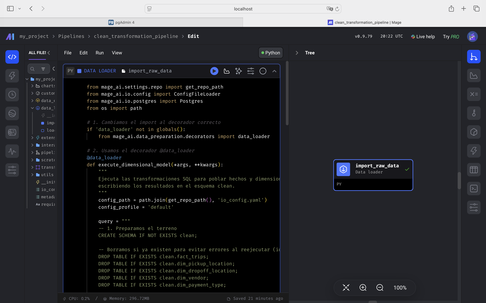

* **Limpieza (Data Quality):** Se aplican filtros duros (`WHERE trip_distance > 0 AND passenger_count > 0`) para eliminar registros imposibles o ruidosos.
* **Tipado Riguroso:** Se aplica un doble *casting* (`::numeric::int` y `::timestamp`) para asegurar que IDs categóricos sean enteros puros y las fechas sean marcas de tiempo válidas.

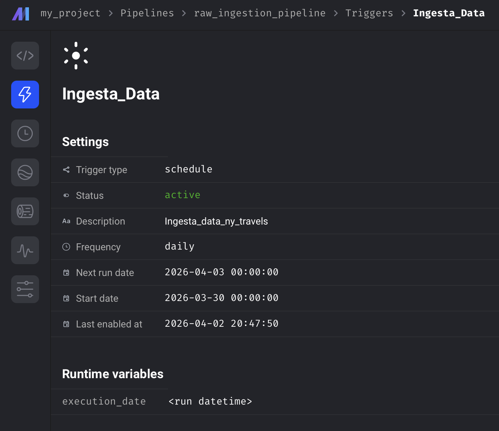
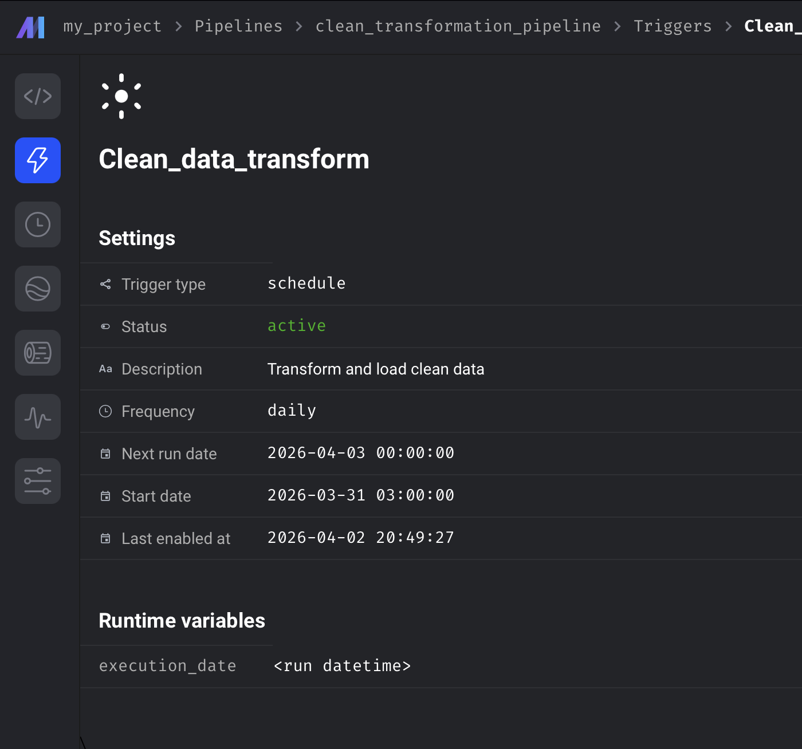
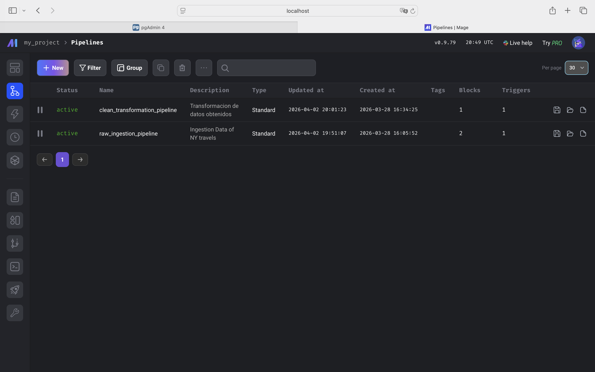

### 3. Estructura de la Base de Datos: Esquemas y Tablas

Para garantizar la separación obligatoria entre datos crudos y transformados exigida por el diseño ELT, la base de datos PostgreSQL se organizó lógicamente en **dos esquemas distintos**:

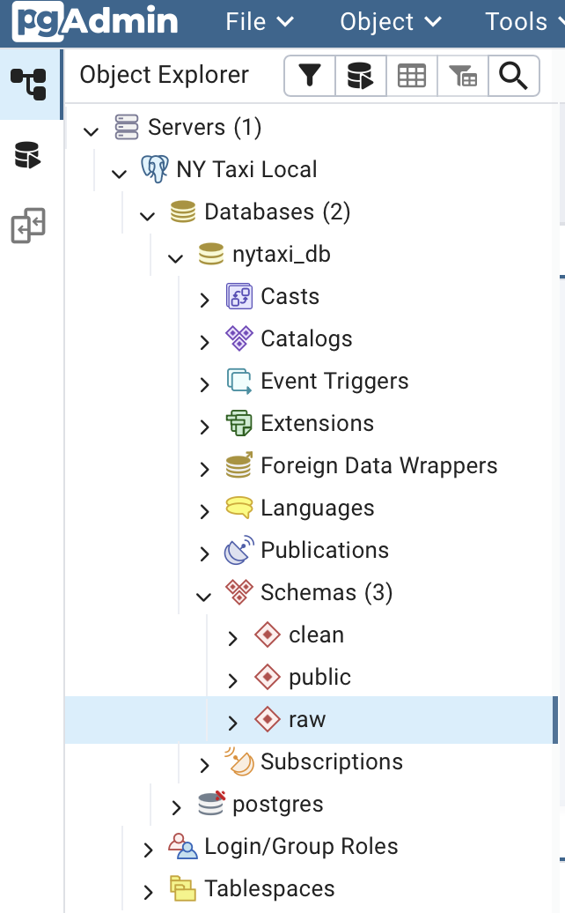

### 📦 Esquema `raw` (Capa de Ingesta)
Este esquema funciona como la zona de aterrizaje de los datos. Almacena la información exactamente como viene de la fuente, actuando como un respaldo histórico inmutable.

* **Tabla `raw.ny_taxi_data`:** Es una tabla plana consolidada que contiene decenas de millones de registros provenientes de los archivos Parquet. Si el NYC TLC añade nuevas columnas en meses futuros, esta tabla evoluciona dinámicamente agregándolas en formato de texto gracias a la validación de *Schema Drift* de nuestro pipeline.

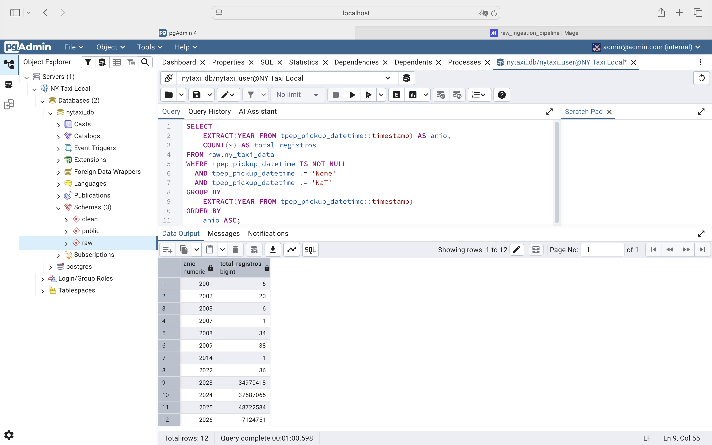

### Esquema `clean` (Capa Analítica y Modelo Dimensional)
Este esquema contiene los datos limpios, validados y estandarizados. Está estructurado bajo un **Modelo de Estrella (Star Schema)**, optimizado para consultas analíticas y herramientas de Business Intelligence. Se compone de las siguientes tablas:

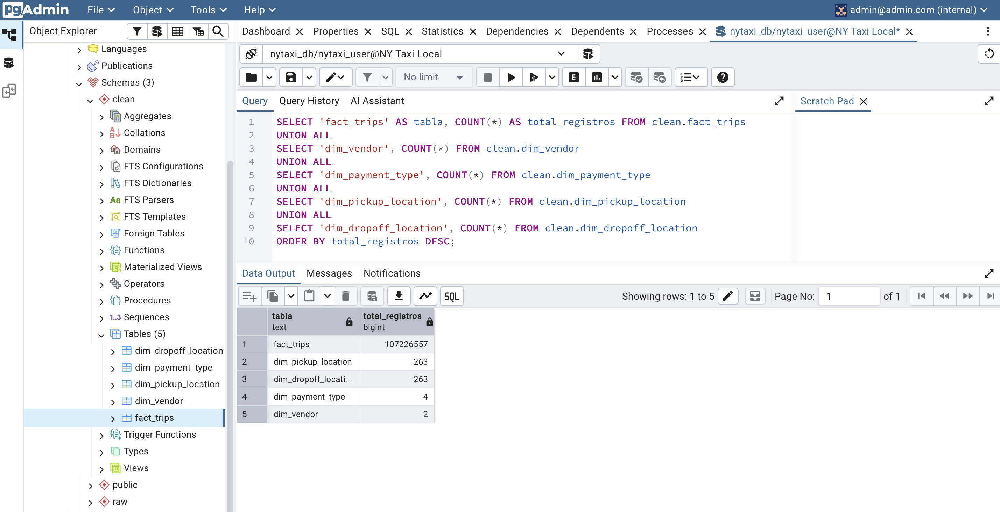

### Validaciones de Calidad de Datos (Capa Clean)

La construcción de la capa `clean` no consiste en una simple copia de los datos crudos. Para garantizar que la información sea verdaderamente útil para el análisis y el Business Intelligence, se implementó un pipeline de transformación ELT con estrictos criterios de *Data Quality* ejecutados directamente en PostgreSQL.

Al poblar nuestra tabla de hechos (`fact_trips`) y nuestras dimensiones espaciales, se aplicaron las siguientes validaciones técnicas y reglas de negocio:

* **Normalización de tipos de datos y estandarización de columnas:** Los datos de la capa `raw` (que entraron como texto por seguridad) fueron casteados rigurosamente. Se aplicó un doble *casting* (`::numeric::int`) para asegurar que las llaves foráneas sean enteros puros, y `::timestamp` para las variables de tiempo. Además, se renombraron las columnas al estándar *snake_case* (ej. de `pulocationid` a `pu_location_id`).

**Normalización de tipos de datos y estandarización de columnas**[cite: 213, 214]: Los datos de la capa `raw` (que entraron como texto por seguridad) fueron casteados rigurosamente. Se aplicó un doble *casting* (`::numeric::int`) para asegurar que las llaves foráneas sean enteros puros, y `::timestamp` para las variables de tiempo. Además, se renombraron las columnas al estándar *snake_case* para facilitar su lectura.

```sql
  SELECT 
      vendorid::numeric::int AS vendor_id,
      pulocationid::numeric::int AS pu_location_id,
      tpep_pickup_datetime::timestamp,
      -- ...
 ```

* **Manejo estricto de valores nulos:** Para proteger la integridad del modelo, se implementaron filtros `IS NOT NULL AND != 'None'` en los campos temporales y en las llaves de las dimensiones espaciales. Esto evita que los valores `NULL` exportados como texto desde Pandas rompan los cálculos analíticos.

```sql
-- Aplicado en la tabla de hechos:
AND tpep_pickup_datetime IS NOT NULL AND tpep_pickup_datetime != 'None'

-- Aplicado en las dimensiones espaciales:
WHERE pulocationid IS NOT NULL AND pulocationid != 'None';
      -- ...
 ```

* **Filtrado de registros imposibles o erróneos:** Se eliminaron las anomalías lógicas del negocio exigiendo que todo viaje válido tenga una distancia mayor a cero (`trip_distance > 0`) y al menos un pasajero (`passenger_count > 0`). Los registros que no cumplen esto se consideran errores de hardware del taxímetro o viajes cancelados.

```sql
WHERE trip_distance::numeric > 0 
  AND passenger_count::numeric > 0
 ```

* **Validación de fechas y timestamps (Filtro de Anomalías):** Es común que los relojes de los taxímetros se desconfiguren tras quedarse sin batería, reportando viajes en los años 1970, 2000, o fechas en el futuro. Para aislar los datos útiles, se limitó la ingesta a una ventana de tiempo lógica: posterior al 1 de enero de 2023 (`>= '2023-01-01 00:00:00'`) y estrictamente anterior a la fecha actual del sistema (`<= CURRENT_TIMESTAMP`).

```sql
AND tpep_pickup_datetime::timestamp >= '2023-01-01 00:00:00'
AND tpep_pickup_datetime::timestamp <= CURRENT_TIMESTAMP
 ```

* **Consistencia temporal (Pickup vs. Dropoff):** Se garantizó la coherencia cronológica de los eventos mediante la regla `tpep_dropoff_datetime > tpep_pickup_datetime`, asegurando que ningún viaje termine antes de haber comenzado.

```sql
AND tpep_dropoff_datetime::timestamp > tpep_pickup_datetime::timestamp;
 ```

* **Validación y generación de nuevas métricas:** Basado en la consistencia de los timestamps validados, se calculó nativamente en SQL la duración real de cada viaje (`trip_duration_seconds`) utilizando la función `EXTRACT(EPOCH FROM ...)`.

```sql
-- Calculamos la duración directamente en SQL
EXTRACT(EPOCH FROM (tpep_dropoff_datetime::timestamp - tpep_pickup_datetime::timestamp)) AS trip_duration_seconds 
```


La capa analítica (`clean`) está estructurada bajo un **Modelo de Estrella (Star Schema)**, compuesto por una tabla central de hechos rodeada de dimensiones descriptivas.

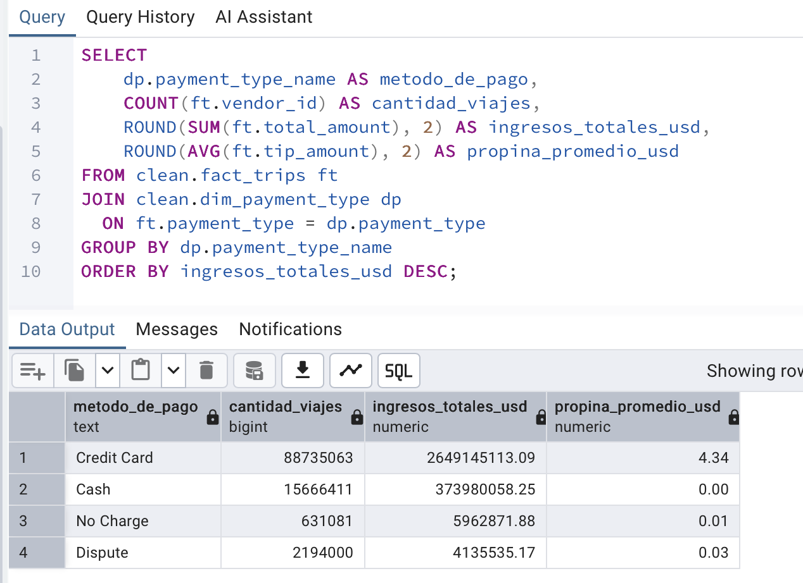
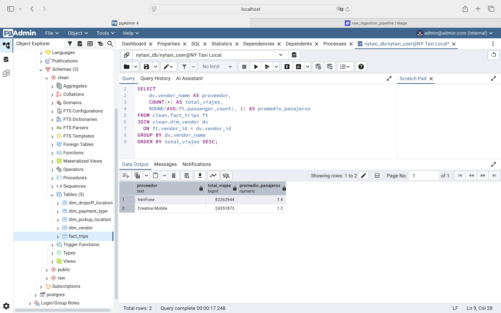

### 🔹 Tabla de Hechos (Fact Table)
**`clean.fact_trips`**: Es el corazón del modelo. Su granularidad es exacta: **1 fila = 1 viaje de taxi**.
* *Claves Foráneas (FK):* `vendor_id`, `pu_location_id`, `do_location_id`, `payment_type`, `rate_code_id`.
* *Timestamps:* `tpep_pickup_datetime`, `tpep_dropoff_datetime`.
* *Métricas Base:* `passenger_count`, `trip_distance`.
* *Métricas Financieras:* `fare_amount` (tarifa base), `extra`, `mta_tax`, `tip_amount` (propina), `tolls_amount` (peajes), `improvement_surcharge`, `total_amount` (monto total).
* *Métricas Derivadas:* `trip_duration_seconds` (calculada restando el tiempo de bajada del de subida).

### 🔸 Dimensiones (Dimension Tables)
Proporcionan el contexto de texto a los IDs numéricos de la tabla de hechos.
* **`clean.dim_vendor`**:
  * `vendor_id` (INT, Clave Primaria)
  * `vendor_name` (TEXT): Almacena los nombres comerciales ('Creative Mobile', 'VeriFone').
* **`clean.dim_payment_type`**:
  * `payment_type` (INT, Clave Primaria)
  * `payment_type_name` (TEXT): Decodifica el método ('Credit Card', 'Cash', 'No Charge', 'Dispute').
* **`clean.dim_pickup_location`**:
  * `location_id` (INT, Clave Primaria): Lista única de las zonas origen autorizadas en NY.
* **`clean.dim_dropoff_location`**:
  * `location_id` (INT, Clave Primaria): Lista única de las zonas destino.

### 🕸️ 4. Diagrama de Grafo del Modelo Estrella

A continuación se presenta la representación visual de la topología de la base de datos `clean` y cómo se comunican las tablas. Las entidades descriptivas (dimensiones) filtran y contextualizan el evento transaccional central (hechos).

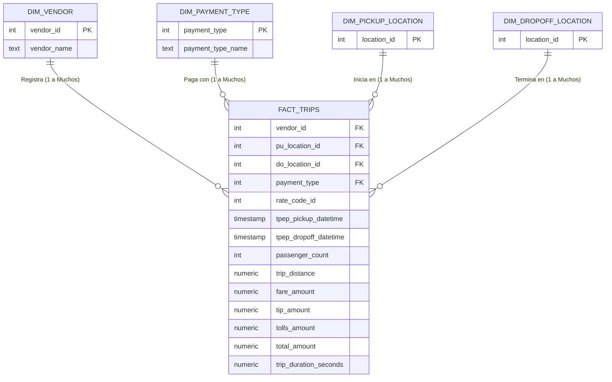


### 🚀 3. Pasos para levantar el entorno
Toda la infraestructura está dockerizada para garantizar la reproducibilidad.

1. **Clonar el repositorio:**
   ```bash
   git clone https://github.com/Guallasamin/pset-2
   cd pset2_ny_taxi
    ```